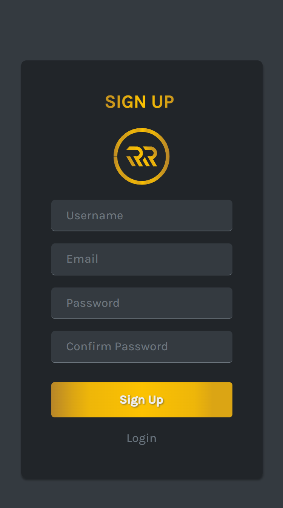

## RR Polls✔️

[RR polls](https://rr-polls.web.app) is a cool web application for designing fancy polls responsive for major devices with more fun and joy.
Using this application, one can create polls, quizzes, get suggestions, public opinion from any number of audience scale from 1 to the highest number you known. The creator is provided with a dashboard console, from which they can **CREATE VIEW DELETE and MANAGE** the polls. The crucial user information is secured by Django-provided security measures and strict authentication and authorization features makes the user to be hassle-free from any type of data theft or information leakage.  
During the [sign up](https://rr-polls.web.app/signup), the users are needed to provide an _Username_, _Email Address_, _Password_ to the form and after successful sign in they are asked to [log in](https://rr-polls.web.app/login) with their _Username_ and _Password_ which are created during sign up process and after successful authentication, they are redirected to the **[Dashboard](https://rr-polls.web.app/dashboard)**. In there, they can see a form for creating poll with one question and one option as required fields. Using that, one can create a poll, and after creation the poll is allocated with a unique link through which the poll can be accessed.  
Adjacent to the link, there is a copy button, which copies the link to the clipboard and below there is provided with [Whatsapp](https://whatsapp.com)  share button which shares the link directly to whatsapp.
The polls that are created by the user are listed below in the dashboard page. If the poll is active, the it is displayed with a delete button which deletes the poll and the corresponding link to the poll.

---

## Technologies Used🧬

* ### Frontend🏞️

  1. HTML
  2. CSS
     * [Bootstrap](https://getbootstrap.com/)
     * [Sass](https://sass-lang.com)
  3. Javascript
     * [React Js](https://reactjs.org)
     * [Jquery](https://jquery.com)
* ### Backend⚒️

  1. Python
     * [Django](https://www.djangoproject.com/)
  2. Apache
     * [Apache 2](https://httpd.apache.org/)

---

## Sample Shots

